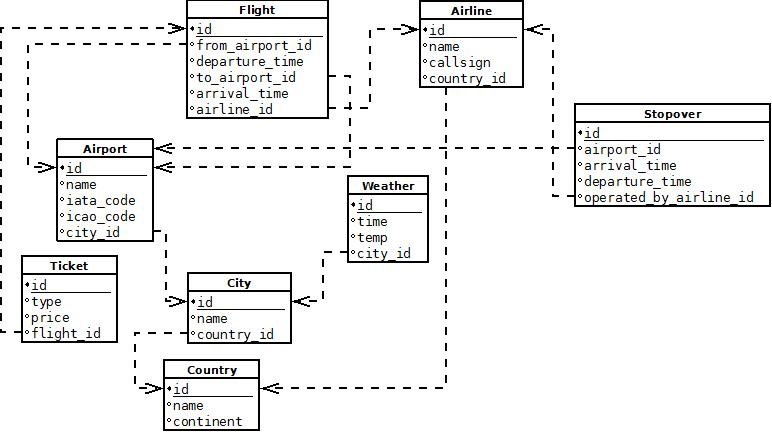

# Understanding Database Systems: My Learning Journey

## My Initial Understanding of Databases
Before starting this unit, I had a basic idea that databases were used to store and organize data. However, I did not fully understand how they worked beyond that. I had heard about SQL and database management systems (DBMS) but was unaware of how crucial they were in handling data efficiently.

## What I Have Learned

### 1. **Database vs. DBMS**
One of the key takeaways from this unit was learning the difference between a **database** and a **database management system (DBMS)**. I initially thought they were the same, but I now understand that a database is just a collection of organized data, while a DBMS is the software that manages and controls access to the data. This distinction helped me appreciate how databases function in large-scale applications. The major differences are stated below :

### 2. **Types of Data Models**
Previously, I thought all databases stored data in tables, but I have now learned about different **data models**, including:
   - **Entity-Relationship Model** – Represents real-world entities and their relationships.
   - **Semi-structured Data Model** – Deals with flexible formats like XML or JSON.
   - **Object-Based Data Model** – Organizes data similar to object-oriented programming.
   - **Relational Model** – Uses tables with unique attributes and is the foundation for SQL databases.

  

  

    
    
Fig.1. the Entity Relationship Data Model.

  

  

    
    
Fig.2. the Relational Model.

  

  

The **relational model** proposedby Edgar F. Codd, a mathematician at IBM Research in 1960's stood out to me because it is widely used in industries and employs **SQL (Sequential Query Language)** for efficient data manipulation. The relational model unlike the early DBMS has separated the logical and physical layers and is easier to maintain.

### 3. **Database Design Process**
Understanding database design was particularly useful. It follows these steps:
   - **Choosing a data model**
   - **Developing a conceptual design** to outline functional needs
   - **Creating a logical design** by mapping it to a schema
   - **Defining the physical design** for optimizing storage and performance

This structured approach ensures databases are well-organized and scalable, which is something I never thought about before.

### 4. **Data Abstraction Levels**
A concept that fascinated me was **data abstraction**, which simplifies complex data structures into different levels:
   - **Physical Level** – Defines how data is stored on disk.
   - **Logical Level** – Describes what data is stored and its relationships.
   - **View Level** – Shows customized views of data to different users.

  

    
    
Fig.3. Data Abstraction levels

  

This layering makes databases easier to work with, as users don’t need to understand the backend storage mechanics.

### 5. **SQL and Database Languages**
Before this unit, I thought SQL was just for retrieving data, but I learned it is divided into:
   - **Data Definition Language (DDL)** – Used for defining schemas (e.g., `CREATE TABLE`).
   - **Data Manipulation Language (DML)** – Used for querying and modifying data (e.g., `SELECT`, `INSERT`).

An interesting realization was that SQL is **non-procedural** or **Declarative DML**, meaning we specify what we need, not how to retrieve it unlike it's counterpart **procedural DML**.

### 6. **Database System Architecture**

Database system architecture defines how a database is structured and accessed. It is mainly categorized into two types:

#### 1. Two-Tier Architecture
- Consists of a **client** (user interface) and a **server** (database).
- The client directly communicates with the database.
- **Advantage:** Simple and fast for small applications.
- **Disadvantage:** Less secure and not scalable.

#### 2. Three-Tier Architecture
- Adds an **application server** between the client and the database.
- The client interacts with the app server, which then processes requests to the database.
- **Advantage:** More secure, scalable, and suitable for large applications.
- **Disadvantage:** More complex and requires additional resources.

  

    
    
Fig.4. Database System Architecture

  

### 7. **Database Engines**
Another new concept for me was **database engines** or **Embedded database**, which handle data storage and processing. The main components include:
   - **Storage Manager** – Manages data storage and retrieval.
   - **Query Processor** – Parses and executes queries.
   - **Transaction Manager** – Ensures data consistency and handles simultaneous users.

I also learned that databases interact with applications using APIs like **ODBC (Open Database Connectivity)**, something I had never considered before.

We even discussed about the different types of database users and the key roles of **Database Administrators** as a part of flipped classroom followed by an interactive quiz.

### 8. **Different Types of Database Users**
Database users are categorized based on their interaction with the database. There are seven main types:

1. **Database Administrator (DBA)**: Manages the database schema, user access, security, backups, and performs administrative tasks like repairing system failures and controlling data access through DCL operations.

2. **Naive / Parametric End Users**: Unskilled users who interact with the database daily but have no DBMS knowledge, such as bank clerks or ticket-booking system users.

3. **System Analyst**: Analyzes user requirements and ensures the database meets those needs.

4. **Sophisticated Users**: Users like engineers and analysts who are familiar with databases and can write SQL queries to interact with the database.

5. **Database Designers**: Responsible for designing the database structure, including tables, indexes, and constraints, to meet user requirements.

6. **Application Programmers**: Develop back-end code for database applications, typically using programming languages like C or Java.

7. **Casual Users**: Occasionally access the database, often for new information, such as middle or senior managers.

Each user type interacts with the database in unique ways, depending on their technical expertise and role.

## Real-Life Applications and Reflections
This unit made me realize how databases are everywhere, used in banking, social media, online stores, and even in personal projects. I now understand why businesses need well-structured databases to manage vast amounts of data efficiently. I also found SQL to be a powerful tool and plan to learn how to work with it to solidify my understanding. I could also have a better knowledge of the different types of database users

## Conclusion
Looking back, I see a huge improvement in my understanding of databases. Instead of just seeing them as storage systems, I now recognize them as **well-designed structures** that ensure data integrity, security, and efficiency. Moving forward, I am eager to explore **relational modeling and ER diagrams** in the next unit!

---
*Stay tuned for more insights as I continue my learning journey!*
