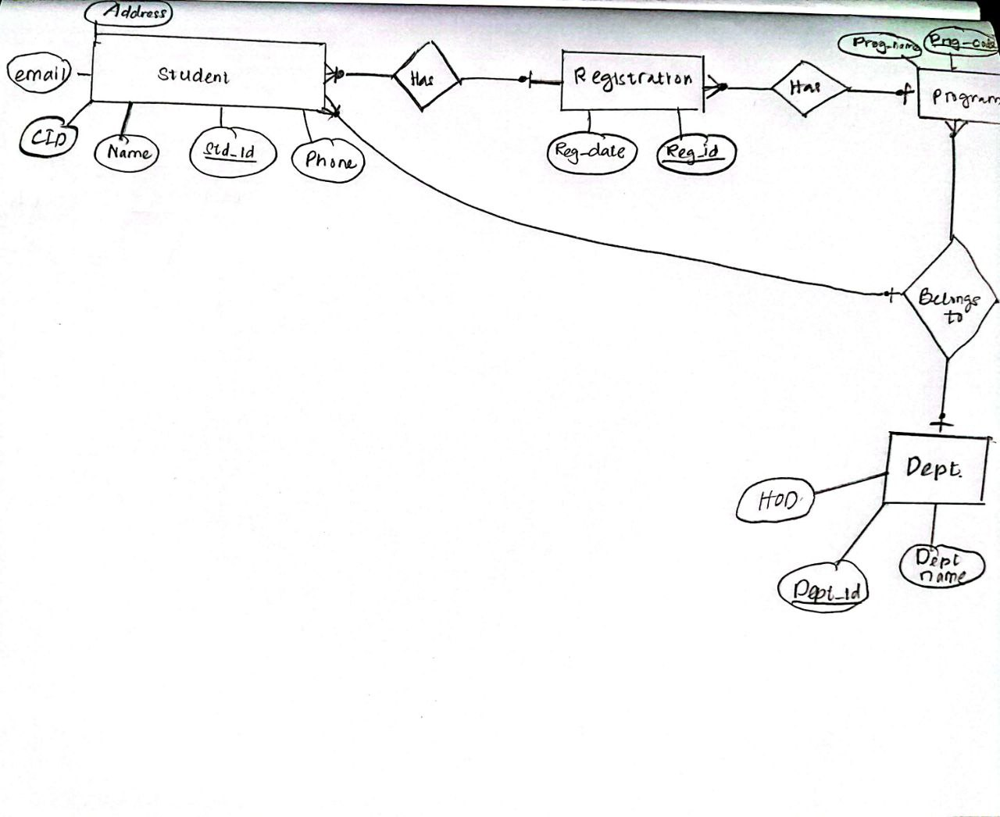
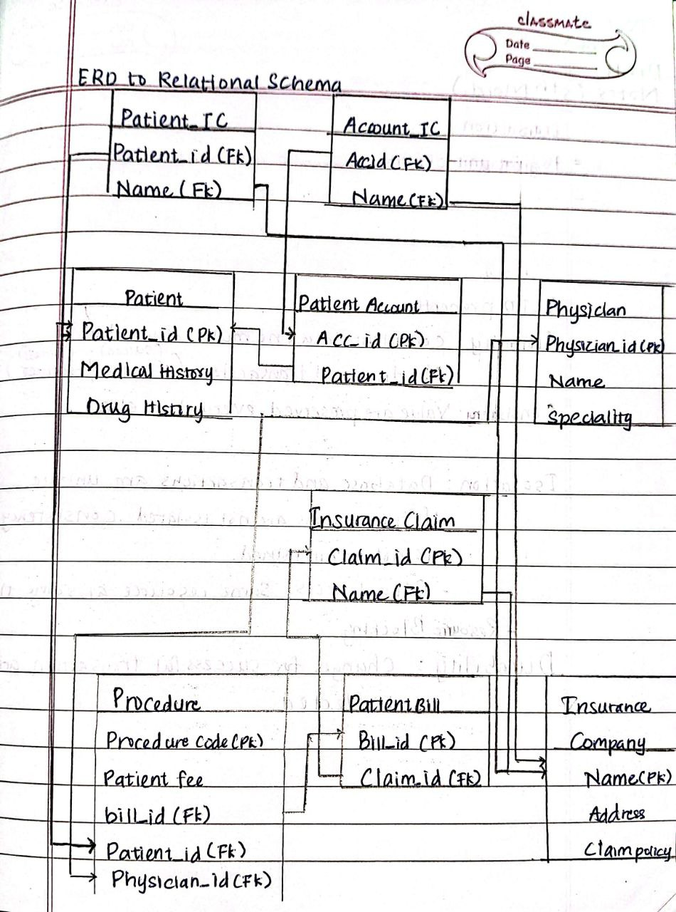

# Mastering Database Design: A Beginner’s Guide from ERD to Relational Algebra

## Introduction  

Ever wondered how databases power everything from social media platforms to university portals and banking apps? Behind every well-structured database is **a solid design**, one that ensures data is **organized, consistent, and easy to retrieve**.  

If you’ve ever struggled to understand how databases are structured, don’t worry, you’re not alone! In this blog, we’re going to break down **four essential topics** that will take you from **database design basics to advanced querying**:  

⭐ **Entity-Relationship Diagrams (ERD)** – The blueprint of any database.  
⭐ **The Relational Model & Schema Design** – How data is structured into tables.  
⭐ **Translating ERDs into Relational Schemas** – Converting designs into working databases.  
⭐ **Relational Algebra** – The math behind database queries.  

By the end, you’ll not only **understand database design** but also be able to **create and manipulate databases like a pro**! 🦾  

---

## What is an ERD, and Why Should You Care?  

Before we start building a database, we need a plan. That’s where **Entity-Relationship Diagrams (ERDs)** come in.  

Think of an ERD as a **map of your database**. It helps you visualize how **data is stored and connected**, so you don’t end up with **a tangled mess of tables** later.  

### 🔹 The Three Building Blocks of an ERD  
- **Entities** → The "things" you want to store data about (e.g., **Students, Courses, Books**).  
- **Attributes** → The details about each entity (e.g., a Student has a **Name, Age, Email**).  
- **Relationships** → How entities are connected (e.g., A **Student** enrolls in a **Course**).  

### 🔹 Attributes: The DNA of Entities  
Attributes tell us **more about an entity**. They come in different flavors:  
- **Simple vs. Composite** → "Age" is simple, but "Full Name" (First Name, Last Name) is composite.  
- **Single-Valued vs. Multi-Valued** → "Email" is single-valued, but "Phone Numbers" can have multiple values.  
- **Derived** → "Age" can be calculated from "Date of Birth."  

### 🔹 How Relationships Work (a.k.a. Cardinality)  
- **One-to-One (1:1)** → One person can have **only one passport**.  
- **One-to-Many (1:M)** → A **teacher** can teach **many students**, but each student has only **one teacher**.  
- **Many-to-Many (M:N)** → A **student** can take **many courses**, and a **course** can have **many students**.  

To make this work in a database, we use **keys**:  
- **Primary Key (PK)** → A unique ID for each record (e.g., **StudentID**).  
- **Foreign Key (FK)** → A reference to another table (e.g., **StudentID** in an Enrollment table).  

---

## Turning ERDs into Tables (The Relational Model)  

Once we have our ERD, it’s time to **turn it into actual database tables**. This is where we enter the **relational model**, which organizes data into **tables (relations)**.  

### 🔹 Key Concepts of the Relational Model  
- **Tables (Relations)** → Think of these as spreadsheets storing related data.  
- **Rows (Tuples)** → Each row is a single record (e.g., one student).  
- **Columns (Attributes)** → Each column stores a specific type of data (e.g., Name, Age).  
- **Schema** → The **blueprint** of a table, defining what data it holds.  

### 🔹 Keys: The Glue That Holds Data Together  
- **Superkey** → A set of attributes that uniquely identify a row.  
- **Candidate Key** → A minimal superkey with no unnecessary attributes.  
- **Primary Key (PK)** → The **main unique identifier** for each row.  
- **Foreign Key (FK)** → Connects one table to another.  

For example, in a **university database**:  
- **StudentID** is the **Primary Key** in the Student table.  
- **CourseID** is the **Primary Key** in the Course table.  
- In the Enrollment table, both **StudentID and CourseID** are **Foreign Keys** linking the tables together.  

---

<p style = "text-align:center">Fig.1. the Entity Relationship Data Model for student registration.</p>

## Converting an ERD into a Relational Schema  

### 🔹 Steps to Convert an ERD into a Relational Schema  
1. **Create a table for each entity.**  
2. **Convert attributes into columns.**  
3. **Handle multi-valued attributes** by creating a separate table.  
4. **Convert relationships into foreign keys** based on cardinality.  
5. **Handle special cases** like specialization, generalization, and aggregation.  

📍 **Example:**  
```sql
CREATE TABLE Student (
    StudentID INT PRIMARY KEY,
    Name VARCHAR(50),
    Age INT
);

CREATE TABLE Enrollment (
    StudentID INT,
    CourseID INT,
    PRIMARY KEY (StudentID, CourseID),
    FOREIGN KEY (StudentID) REFERENCES Student(StudentID),
    FOREIGN KEY (CourseID) REFERENCES Course(CourseID)
);
```  

<p style = "text-align:center">Fig.2. ERD to Relational schema.</p>

---

## Relational Algebra (The Math Behind Databases)  

Relational algebra is the **theoretical foundation** of database queries. It’s like SQL, but more abstract. It is divided into two major operstions, **Unary** and **Binary** operations.

### 🔹 Common Relational Algebra Operations  
- **Selection (σ)** → Filters rows based on conditions.  
- **Projection (π)** → Selects specific columns.  
- **Union (∪)** → Combines results from two tables.  
- **Join (⋈)** → Combines rows from two tables based on a common attribute. 
- **Cartesian product(x)** → Concatenates the tuples from both input relations. 

📍 **Example:**  
```sql
SELECT * FROM Student WHERE StudentNo = "12345";
```  

---

## Conclusion: Why This Matters  

A well-structured database:  
⭐ **Avoids redundant data.**  
⭐ **Ensures fast and efficient queries.**  
⭐ **Makes data easy to manage and update.**  

If you master **ERDs, relational models, schema design, and relational algebra**, you’ll be able to **design and manage powerful databases** that scale efficiently.  

Hope this piece of work as a good read! See you again in the next blog! 😒

