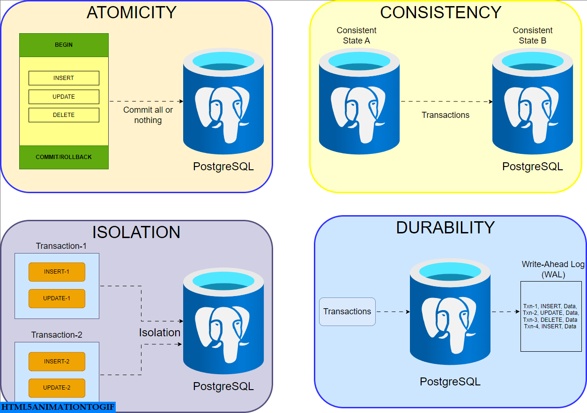

# Exploring the Foundations of Database Design: Key Learnings from Unit 3

  

---
## What I Learned in Database Design

This unit has provided me with a deeper understanding of the foundational principles of database management. Here are the core concepts I’ve grasped:

### **1. ACID Properties: Ensuring Reliable Transactions**
ACID properties (Atomicity, Consistency, Isolation, and Durability) form the backbone of reliable database transactions. Understanding these ensures that database transactions are completed accurately and consistently, maintaining the integrity of data even in complex or concurrent environments.

  

### **2. SQL: The Heart of Database Interaction**

SQL (Structured Query Language) is the primary tool used to interact with relational databases. Mastering its core functions is crucial for efficient data management. Some of the key SQL operations include:

- **`SELECT`**: This is the most common SQL command used to retrieve data from one or more tables in a database. For example, `SELECT * FROM Employees;` retrieves all records from the `Employees` table.
  
- **`INSERT`**: This command is used to add new records to a table. For example, `INSERT INTO Employees (Name, Age) VALUES ('John', 30);` adds a new employee with the name "John" and age 30.

- **`UPDATE`**: This command modifies existing records in a table. For example, `UPDATE Employees SET Age = 31 WHERE Name = 'John';` updates John's age to 31 in the `Employees` table.

- **`DELETE`**: This command removes records from a table. For example, `DELETE FROM Employees WHERE Age = 31;` deletes all employees aged 31.

SQL also has powerful features that allow us to filter, group, and aggregate data:

- **`WHERE` Clause**: This clause is used to filter records based on a specified condition. For example, `SELECT * FROM Employees WHERE Age > 30;` retrieves employees whose age is greater than 30.

- **Aggregate Functions**: These are functions that perform calculations on a set of values and return a single result. Common aggregate functions include:
  - **`COUNT`**: Returns the number of rows that match a condition. For example, `SELECT COUNT(*) FROM Employees WHERE Age > 30;` counts how many employees are older than 30.
  - **`SUM`**: Adds up the values of a specified column. For example, `SELECT SUM(Salary) FROM Employees;` calculates the total salary of all employees.
  - **`AVG`**: Returns the average of a specified column. For example, `SELECT AVG(Salary) FROM Employees;` gives the average salary of employees.

- **Joins**: SQL joins allow you to combine data from two or more tables based on a related column. For example:
  - **`INNER JOIN`**: Returns records that have matching values in both tables. For example, `SELECT * FROM Orders INNER JOIN Customers ON Orders.CustomerID = Customers.CustomerID;` retrieves all orders with customer details.
  - **`LEFT JOIN`**: Returns all records from the left table and matching records from the right table. If there’s no match, it returns `NULL` for the right table’s columns.

These SQL tools allow us to work with and manipulate data in a relational database efficiently, making SQL an essential skill for anyone working with databases.


### **3. Database Schema and Constraints: Building a Strong Foundation**

Designing a **database schema** is a critical step in creating a well-structured and efficient database. It involves defining the tables, relationships, and constraints that form the backbone of the database. The goal is to ensure data integrity, minimize redundancy, and establish a clear structure for how data should be stored and accessed. 

#### **Database Schema**
A **database schema** represents the logical structure of a database. It defines the tables, columns, data types, and the relationships between tables. Proper schema design ensures the database is efficient, flexible, and scalable.

For example, a schema for an e-commerce system might include tables like `Products`, `Customers`, and `Orders`, with each table having specific attributes (e.g., `ProductID`, `Price`, `CustomerName`, etc.).

#### **Constraints: Ensuring Data Integrity**
Constraints are rules applied to database columns to enforce data integrity and consistency. The most common types of constraints include:

- **Primary Key**: A primary key uniquely identifies each record in a table. It ensures that no two rows in a table have the same value in the primary key column(s). For example, in a `Users` table, the `UserID` could be the primary key.
  - Example: 
    ```sql
    CREATE TABLE Users (
        UserID INT PRIMARY KEY,
        Username VARCHAR(255) NOT NULL,
        Email VARCHAR(255) UNIQUE
    );
    ```

- **Foreign Key**: A foreign key creates a relationship between two tables by linking a column in one table to the primary key of another table. It ensures referential integrity by enforcing that a record in one table corresponds to a record in another table.
  - Example: 
    ```sql
    CREATE TABLE Orders (
        OrderID INT PRIMARY KEY,
        UserID INT,
        OrderDate DATE,
        FOREIGN KEY (UserID) REFERENCES Users(UserID)
    );
    ```

- **Check Constraint**: A check constraint ensures that values in a column meet a specified condition. This helps maintain valid data by preventing incorrect entries, like negative numbers in an age column.
  - Example:
    ```sql
    CREATE TABLE Employees (
        EmployeeID INT PRIMARY KEY,
        Age INT CHECK (Age >= 18)
    );
    ```

- **Unique Constraint**: This constraint ensures that all values in a column are unique across the table. It is often used for columns that require unique values, like email addresses or usernames.
  - Example:
    ```sql
    CREATE TABLE Customers (
        CustomerID INT PRIMARY KEY,
        Email VARCHAR(255) UNIQUE
    );
    ```

#### **Why Constraints Matter**
1. **Data Integrity**: Constraints prevent invalid data from being entered into the database, ensuring consistency and accuracy.
2. **Efficiency**: With well-defined constraints, querying and updating data becomes more reliable and faster.
3. **Redundancy Reduction**: By enforcing relationships between tables, foreign keys prevent unnecessary data duplication, ensuring efficient data storage.

 A well-designed **database schema** combined with effective **constraints** ensures that your database remains reliable, consistent, and scalable.


Here’s the complete Markdown snippet with the aggregate functions section integrated into the previous content:

```markdown
### **4. Null Values and Aggregate Functions**

Dealing with **null values** is an essential aspect of working with databases, as they represent missing, undefined, or unknown data. Null is not equivalent to zero, an empty string, or any other value—it's simply a placeholder indicating the absence of data.

#### **Handling Null Values**
- **Null in Arithmetic Operations**: If any operand in an arithmetic operation is `NULL`, the result will be `NULL`. For example, `NULL + 5` results in `NULL`.
- **Null in Comparisons**: When comparing values with `NULL`, SQL uses three-valued logic: `TRUE`, `FALSE`, and `UNKNOWN`. For example, `5 < NULL` returns `UNKNOWN`. To explicitly check for `NULL`, SQL uses the `IS NULL` and `IS NOT NULL` operators:
  ```sql
  SELECT * FROM Employees WHERE Salary IS NULL;
  ```
Handling null values correctly is important when performing calculations or filtering data to avoid errors or inaccurate results.

---

### **Aggregate Functions: Summarizing Data**
Aggregate functions are used to perform calculations on a set of values and return a single result, such as totals, averages, or counts. Some common aggregate functions include:

- **COUNT()**: Returns the number of rows that match the specified condition, excluding NULL values.
  ```sql
  SELECT COUNT(*) FROM Employees WHERE Department = 'Sales';
  ```
- **SUM()**: Returns the sum of values in a specified column. It ignores NULL values in the calculation.
  ```sql
  SELECT SUM(Salary) FROM Employees WHERE Department = 'HR';
  ```
- **AVG()**: Calculates the average of values in a specified column, excluding NULL values.
  ```sql
  SELECT AVG(Salary) FROM Employees;
  ```
- **MIN() and MAX()**: Return the minimum and maximum values from a column, respectively. These functions also ignore NULL values.
  ```sql
  SELECT MIN(Salary) FROM Employees;
  ```

Aggregate functions are invaluable when working with large datasets, allowing us to derive meaningful insights such as averages, totals, or counts based on specific criteria.

---

### **5. Nested Subqueries and Joins: Advanced Data Retrieval**

#### **Nested Subqueries**
A nested subquery is a query that is embedded inside another query. Subqueries allow for complex data retrieval by enabling one query to depend on the result of another. Subqueries can be used in various clauses, such as WHERE, FROM, or SELECT, to filter or aggregate data dynamically.

Example: Find employees who earn more than the average salary:
```sql
SELECT Name, Salary
FROM Employees
WHERE Salary > (SELECT AVG(Salary) FROM Employees);
```
Subqueries are useful for situations where you need to reference another result set without joining multiple tables explicitly.

#### **Joins: Combining Data from Multiple Tables**
A join is used to combine rows from two or more tables based on a related column. Joins are essential for pulling together data that is spread across different tables, such as combining customer and order information from two separate tables.

- **Inner Join**: Returns rows when there is a match in both tables.
  ```sql
  SELECT Customers.Name, Orders.OrderID
  FROM Customers
  INNER JOIN Orders ON Customers.CustomerID = Orders.CustomerID;
  ```
- **Left Join**: Returns all rows from the left table and matched rows from the right table. If there is no match, the result is NULL on the side of the right table.
  ```sql
  SELECT Customers.Name, Orders.OrderID
  FROM Customers
  LEFT JOIN Orders ON Customers.CustomerID = Orders.CustomerID;
  ```
- **Right Join**: Similar to a left join but returns all rows from the right table and matched rows from the left table.
  ```sql
  SELECT Customers.Name, Orders.OrderID
  FROM Customers
  RIGHT JOIN Orders ON Customers.CustomerID = Orders.CustomerID;
  ```
- **Full Join**: Returns all rows when there is a match in either table. If no match exists, the result is NULL on the side of the non-matching table.
  ```sql
  SELECT Customers.Name, Orders.OrderID
  FROM Customers
  FULL OUTER JOIN Orders ON Customers.CustomerID = Orders.CustomerID;
  ```

#### **Why Joins Matter**
- **Combining Data**: Joins allow you to create more comprehensive reports by pulling together related data from different tables.
- **Efficiency**: Instead of querying each table separately, joins enable you to combine results in a single query, making your database operations more efficient.


In summary, both nested subqueries and joins are powerful tools for advanced data retrieval. Subqueries allow you to perform complex filtering and aggregation within a single query, while joins help combine and organize data from multiple tables to generate comprehensive insights.


## Key Takeaways

- **ACID Properties** ensure that database transactions are processed reliably and consistently.
- **SQL commands** such as `SELECT`, `INSERT`, `UPDATE`, and `DELETE` are essential for interacting with databases and manipulating data.
- **Database constraints** like **primary keys** and **foreign keys** are crucial for ensuring data integrity and relational consistency.
- Understanding **null values** and how to handle them is key to accurate data analysis.
- **Aggregate functions** help in summarizing large amounts of data, while **subqueries** and **joins** enable complex and flexible data retrieval.


## Real-Life Applications of SQL

SQL is used in a variety of industries to manage and analyze data. Here are some real-life applications:

- **E-commerce**: SQL is used to manage product catalogs, track customer orders, and analyze sales data. For example, an e-commerce site can use SQL to determine which products are most popular or to track customer purchase histories.
  
  

- **Banking**: Banks use SQL to manage customer accounts, transaction histories, and loan records. SQL ensures that financial transactions are reliable, secure, and processed efficiently.

 

- **Healthcare**: In the healthcare industry, SQL databases store patient information, treatment histories, and appointment schedules. These databases are critical for managing patient care and ensuring regulatory compliance.

  

---

## Future Prospects of SQL

As technology continues to evolve, the role of SQL in managing and analyzing data is becoming increasingly important. Some future trends include:

- **Integration with NoSQL**: Many organizations are now combining the reliability of SQL with the scalability of NoSQL databases to manage large datasets. This hybrid approach allows for both structured and unstructured data handling.

- **Artificial Intelligence and SQL**: AI tools are being developed to help automate tasks like query optimization and anomaly detection, enabling faster and more accurate data analysis.

- **Cloud Databases**: With the rise of cloud computing, cloud-based SQL services are becoming more prevalent. These services offer scalability, flexibility, and easier management for organizations of all sizes.


---

## Conclusion

This unit has been a journey through the fundamental concepts of **database design** and **SQL**, equipping me with the tools needed to manage and manipulate relational data effectively. By understanding the key principles like **ACID properties**, **aggregate functions**, and **subqueries**, I now feel confident in my ability to design, interact with, and maintain a relational database. 

As databases continue to evolve, mastering SQL remains essential for handling large datasets, making data-driven decisions, and ensuring data integrity across various industries. I am excited to dive deeper into more advanced topics such as **database optimization**, **indexing**, and **query performance tuning** in future lessons.

---

*Stay tuned for more as I continue to explore the world of databases and SQL!*

---
