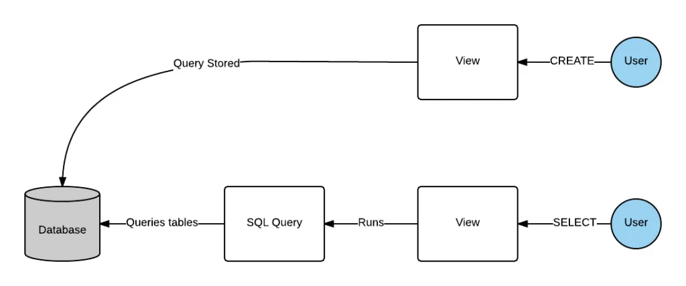

## 🧠 Lesson 9: A Deep Dive into Advanced SQL


This week’s database systems class was particularly insightful. We dove into **join expressions**, **views**, **integrity constraints**, **data types**, **schemas**, **domains**, and **user-defined types**. I’m going to summarize the key takeaways from what I learned in Lesson 9.

---

## 🔗 Join Expressions

Joins are a way to combine rows from two or more tables based on a related column between them. We explored several types of joins:

### 🌿 Natural Join

```sql
SELECT Orders.OrderID, Customers.CustomerName, Orders.OrderDate
FROM Orders
NATURAL JOIN Customers;
```

- Combines rows based on columns with the same names and compatible data types.
- No need to specify the join condition.

### 🔄 Inner Join

```sql
SELECT Orders.OrderID, Customers.CustomerName, Orders.OrderDate
FROM Orders
INNER JOIN Customers ON Orders.CustomerID = Customers.CustomerID;
```

- Combines rows with matching values in both tables.

### 🌍 Outer Join

```sql
-- LEFT OUTER JOIN
SELECT *
FROM Patient
LEFT JOIN Appointment ON Patient.PatientID = Appointment.PatientID;

-- FULL OUTER JOIN
SELECT *
FROM Patient
FULL OUTER JOIN Appointment ON Patient.PatientID = Appointment.PatientID;
```

- **LEFT JOIN**: All records from the left table and matched ones from the right.
- **RIGHT JOIN**: All records from the right table and matched ones from the left.
- **FULL OUTER JOIN**: All matched and unmatched records from both sides.

---

## 🪟 Views in SQL

A **view** is a virtual table based on a SQL query. It doesn't store data but derives it from the base table. Views help simplify complex queries, enhance security, and abstract data access.

### Creating a View

```sql
CREATE VIEW swefaculty AS
SELECT ID, name, deptname
FROM instructor
WHERE deptname = 'swe';
```

---

## 📦 Materialized Views

Materialized views store query results physically and are refreshed periodically.

### Creating a Materialized View

```sql
CREATE MATERIALIZED VIEW top_instructors AS
SELECT name, deptname, salary
FROM instructor
WHERE salary > 50000;
```


 
<p style = "text-align: center">Fig1.Views</p>

  
<p style = "text-align: center">Fig2.Materialized Views</p>
### Refreshing and Indexing

```sql
REFRESH MATERIALIZED VIEW top_instructors;

CREATE INDEX idx_salary ON top_instructors(salary);
```

---

## ✍️ Updatable Views

Not all views are updatable. A view is updatable if:
- It contains only one base relation.
- No aggregates, `GROUP BY`, or `HAVING` clauses.
- Only selects simple attributes of the base relation.

---

## 🛡️ Integrity Constraints

SQL allows the definition of **integrity constraints** to maintain database accuracy and consistency:

| Constraint               | Meaning |
|--------------------------|---------|
| Entity Integrity         | Primary key must not be null. |
| Domain Constraints       | Values must follow valid domain rules (e.g., age must be > 0). |
| Referential Integrity    | Foreign key values must exist in the referenced table. |
| Key Constraint           | Each tuple must be unique for a given key. |

---

## 📚 Data Types and Schemas

SQL provides a variety of **data types** and **schema features** to manage complex data structures.

### Temporal Data Types

| Type             | Description |
|------------------|-------------|
| `date`           | Stores only date. |
| `time`           | Stores time with nanosecond precision. |
| `datetime2`      | Stores date and time. |
| `datetimeoffset` | Includes timezone offset. |
| `smalldatetime`  | Less precise and smaller range. |

---

### 🔁 Type Conversion

```sql
SELECT CAST(ID AS numeric(5)) AS instid 
FROM instructor 
ORDER BY instid;
```

- `CAST` is used to convert data types.

---

### 🔒 Default Values

```sql
CREATE TABLE student (
  ID VARCHAR(5),
  name VARCHAR(20) NOT NULL,
  deptname VARCHAR(20),
  totcred NUMERIC(3,0) DEFAULT 0,
  PRIMARY KEY (ID)
);
```

- You can assign default values to attributes.

---

## 🧱 Working with Large Objects (LOBs)

For storing media or large content, SQL supports large object types.

### Example

```sql
bookReview CLOB(10KB)
image BLOB(10MB)
movie BLOB(2GB)
```

### PostgreSQL Specific LOB Types

| Type         | Max Size | Use Case |
|--------------|----------|----------|
| BYTEA        | < 1MB    | Small binary files or images |
| TEXT         | < 1GB    | Articles, paragraphs |
| JSONB        | < 1GB    | Structured JSON with indexing |
| XML          | < 1GB    | Markup data |
| Large Object | < 4TB    | Videos, audio, etc. |

---

## 🧬 Domains and User-Defined Types

SQL supports custom types and reusable rules.

### 💡 Distinct Type

```sql
CREATE TYPE Dollars AS NUMERIC(12,2) FINAL;
```

### 🧠 Domain

A domain defines a new type with constraints:

```sql
CREATE DOMAIN phone_type AS VARCHAR(10)
CHECK (VALUE ~ '^\d{10}$');
```

---

## 🔑 Auto-Increment Identifiers

SQL provides serial types for automatic numbering.

```sql
CREATE TABLE MedicalProcedure (
  ProcedureID SERIAL PRIMARY KEY,
  ProcedureName VARCHAR(100),
  Description TEXT,
  Cost DECIMAL(10, 2)
);
```

| Type         | Size  | Range              |
|--------------|-------|--------------------|
| SMALLSERIAL  | 2 B   | 1 to 32,767        |
| SERIAL       | 4 B   | 1 to 2.1 billion   |
| BIGSERIAL    | 8 B   | 1 to 9 quintillion |

---

## 🧪 Table Cloning

We can create a new table by cloning the structure of an existing one:

```sql
CREATE TABLE temp_instructor (LIKE instructor INCLUDING ALL);
```

---

## 🎯 Final Thoughts

Lesson 9 was all about refining SQL knowledge,understanding powerful constructs like joins, views, constraints, domains, and user-defined types. These concepts allow us to work with SQL in more efficient, secure, and scalable ways. I'm beginning to appreciate how structured and robust relational databases can be when implemented thoughtfully.

---

## ✅ Reflections & What I Want to Explore Next

- **Experimenting with Materialized Views** for performance testing.
- **Creating PostgreSQL domains** for consistent validation across tables.
- **Applying large object types** to real-world media applications.

---

Thanks for reading! More to come in the next blog ✨  

