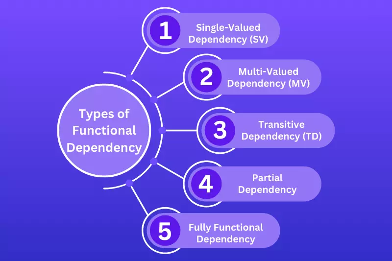

# Crafting Better Databases: My Learning Journey Through Unit 5


## My Initial Understanding of Database Design

Before diving into Unit 5, my understanding of database design was pretty basic — like trying to organize a library without knowing how to categorize books. I knew databases needed structure, but I didn't realize how critical good design choices were until now. I knew databases needed to be structured properly to avoid problems, but I didn't realize just how important design decisions like normalization, decomposition, and dependency theory really were. I had heard the term "normal forms" before, but I didn't fully appreciate how essential they are for keeping databases efficient and clean.

## What I Have Learned

### 1. Features of Good Relational Designs

One of the first lessons that really stood out was what makes a relational database good. Here’s what I learned:

| Feature | Explanation |
|:--------|:------------|
| **Entity-Based Relations** | Each table should represent one entity or relationship. Mixing different entities together is a recipe for confusion. |
| **Minimize Null Values** | Tables should be designed so that NULL values are rare. Too many NULLs are a red flag for bad design. |
| **No Spurious Tuples** | Decomposition needs to be done carefully to avoid generating meaningless results when performing JOIN operations. |
| **No Redundancy** | Repeating data wastes storage and leads to inconsistencies. |
| **Avoid Modification Anomalies** | A good design prevents messy issues when updating, inserting, or deleting data. |

At first, this list seemed obvious, but once we dove into examples, I realized how easy it is to accidentally break these rules.

### 2. Normalization and Normal Forms

Normalization is like "tidying up a messy closet" — sorting everything into its proper place so you can find exactly what you need without digging through a pile of chaos. It’s all about organizing the data to reduce clutter and make it easier to work with.

We explored several normal forms:

- **1NF (First Normal Form)** - Each field contains only atomic values.
- **2NF (Second Normal Form)** - No partial dependencies.
- **3NF (Third Normal Form)** - No transitive dependencies.
- **BCNF (Boyce-Codd Normal Form)** - Even stricter than 3NF.
- **4NF** - Deals with multivalued dependencies.
- **5NF** - Addresses join dependencies.

Learning about normalization made me realize that database design isn’t just about structure, it's about making future work easier and safer.

### 3. Functional Dependencies and Decomposition


Functional Dependency (FD) theory felt a bit like solving a logic puzzle, and honestly, it was fun! I remember one exercise where I had to find a minimal cover for a set of dependencies, and it felt exactly like piecing together a jigsaw puzzle, seeing everything click into place was incredibly satisfying.

Important concepts:

- **Superkey**: A set of attributes that uniquely identify a tuple.
- **Functional Dependency (X → Y)**: Knowing X lets you find Y.
- **Lossless Decomposition**: Breaking tables without losing any information.
- **Dependency Preservation**: Making sure we don’t lose important rules during decomposition.

Understanding how to carefully break down tables without introducing errors or losing important connections was a major eye-opener.

### 4. Multivalued Dependencies and 4NF

Even if a database satisfies BCNF, it can still have redundant data because of multivalued dependencies (MVDs).

For example, an instructor might have multiple departments and multiple addresses, and these are independent pieces of information. Without proper handling, the address would be unnecessarily repeated for each department.

**Multivalued Dependency Example:**

An `Instructor(ID, Department, Address)` can be split into two tables to avoid repetition.

That’s where **Fourth Normal Form (4NF)** comes in. It ensures no redundancy from independent data values!

### 5. Understanding Atomic Domains and 1NF

An "atomic domain" basically means keeping things simple.

Instead of combining fields like this:

```
Address = "123 Main Street, New York, NY"
```

We separate them:

```
Street = "123 Main Street", City = "New York", State = "NY"
```

This change may seem small but it makes querying and updating the database so much easier and safer.

### 6. Database Design Process

Another surprising lesson: Normalization is not always the first step. We usually start with:

- A well-designed Entity-Relationship (E-R) diagram,
- A large schema broken down by normalization,
- Or an ad-hoc schema fixed later.

Normalization is the clean-up stage — but the initial design still matters A LOT!

I also found out that sometimes we deliberately **denormalize** databases for better performance — but that requires careful handling to avoid inconsistencies.

### 7. Modeling Temporal Data

Finally, we learned about **temporal data** — data that changes over time.

For example:

An instructor's address might change from one semester to the next.

We model this by adding:

- **Start Date**
- **End Date**

This was something I had never thought about before, and it made me appreciate how complex real-world databases can be.

## Real-Life Applications and Reflections

Unit 5 showed me that a good database isn’t just neat — it's like the invisible engine powering every major app, ensuring everything runs smoothly, reliably, and efficiently. Whether it’s e-commerce platforms, university systems, or social networks, these principles make data management smooth and reliable.

I now understand why database architects spend so much time planning schemas and getting it right from the start saves years of future headaches!

## Conclusion

Looking back, Unit 5 taught me how deeply mathematical and strategic database design can be.

By applying concepts like functional dependencies, normalization, and temporal modeling, we can create databases that are not just functional but smart and future-proof.

I'm really excited to learn more about optimization techniques and indexing in the upcoming lessons! I wonder how databases achieve lightning-fast query speeds and how indexing strategies could change everything we know about performance. Can't wait to find out!

**Stay tuned for more discoveries in my database learning journey!**
