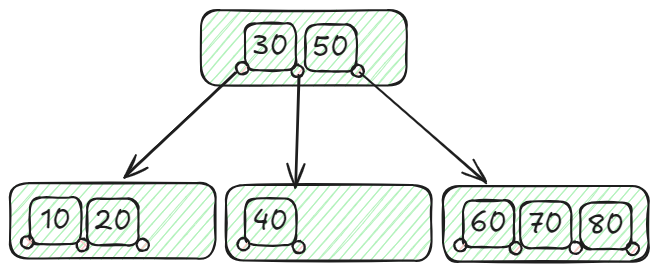

# Mastering Database Efficiency: My Journey Through Unit 6  
  

## My Initial Thoughts on Database Efficiency  

Before Unit 6, I thought that speeding up database queries was just a matter of adding a few indexes here and there or writing SQL queries differently. I didn’t realize that achieving true database efficiency is like solving a complex puzzle — each piece must fit perfectly, from indexing strategies to query optimization techniques. Now, I understand that speeding up a database requires thoughtful planning, not just quick fixes.  

## What I Have Learned  

### 1. Indexing: The Secret to Fast Data Access  

If databases were libraries, indexes would be the catalog system. Without indexes, finding a single record in a massive database would be like searching for a book without knowing its title or author.  

The most impactful takeaway for me was how different types of indexes serve different purposes:  

- **Ordered Indices (like B+ Trees)** are great for range queries.  
- **Hashed Indices** are perfect for quick lookups but struggle with range searches.  
- **Multilevel Indices** help when data size exceeds memory.  
- **Secondary Indices** allow searching on non-key attributes, making queries more flexible.  

The most eye-opening part was realizing that poorly chosen indexes can actually slow down query performance, especially during updates. It’s crucial to match the indexing strategy to the type of data retrieval needed.  

### 2. B+ Trees and Hash Indices: Choosing the Right Tool  

I’ve always thought of indexes as a single concept, but Unit 6 made me see the difference between **B+ Trees** and **Hash Indices**.  

  

- **B+ Trees:** Efficient for both equality and range queries. Ideal for sorted data.  
- **Hash Indices:** Super fast for equality checks but inefficient for range queries.  

Knowing when to use each made me realize that efficient data access is not just about indexing, but about choosing the right index type.  

### 3. Query Processing: More Than Just Running SQL  

Query processing is like translating a recipe from a cookbook to a kitchen workflow. The steps include:  

  
1. **Parsing and Translation:** Convert the query into a structured format.  
2. **Optimization:** Decide the most efficient way to execute the query.  
3. **Execution:** Carry out the optimized plan.  

I found it fascinating that SQL doesn’t dictate how a query is executed; it just defines what result is needed. The **query optimizer** then picks the best route to get there, balancing factors like disk I/O and CPU usage.  

### 4. Optimization Techniques: The Art of Doing More with Less  

Optimization isn’t just about making queries faster — it’s about making them smarter. The main goal is to reduce resource consumption while delivering accurate results.  

The **cost-based approach** was particularly intriguing:  
- The optimizer generates multiple execution plans.  
- It estimates the cost of each plan, including disk I/O and CPU time.  
- The plan with the lowest cost wins.  

I also learned about **heuristic optimization**, which uses rules to quickly narrow down the best options. For instance, performing **selections early** can reduce the amount of data processed in later stages.  

One practical insight was how the **order of joins** can dramatically impact performance. Joining smaller filtered datasets first can drastically cut down processing time.  

### 5. Pipelining vs. Materialization: Real-Time vs. Complex Queries  

When executing queries, the database can either:  
- **Pipeline:** Pass intermediate results directly to the next operation.  
- **Materialize:** Store intermediate results in temporary tables.  

Pipelining is faster and uses fewer resources, but it’s not suitable for complex multi-step operations where intermediate results are needed repeatedly. Materialization handles complexity well but comes with a high I/O cost.  

### 6. Real-World Efficiency: How Theory Meets Practice  

What struck me the most was how these techniques work together in real-world scenarios. For instance, combining B+ Trees with cost-based optimization can drastically reduce response times in large e-commerce databases. Similarly, pipelining makes real-time data processing efficient, especially for applications like live data analytics.  

I realized that being efficient isn’t just about raw speed; it’s about strategically using resources. Sometimes a slightly slower plan is better if it consumes fewer resources, especially in large, multi-user environments.  

## Real-Life Applications and Reflections  

Unit 6 fundamentally changed my approach to database efficiency. Instead of seeing optimization as a single step, I now see it as an ongoing process that combines **smart indexing, query planning, and careful execution**. It’s not just about making things fast but making them consistently efficient.  

By mastering these concepts, I feel more confident about handling large-scale data challenges. I’m excited to dive deeper into performance tuning and see how these techniques apply to real-world database systems.  

## Conclusion  

Unit 6 taught me that database performance is not a one-size-fits-all problem. It’s a careful balancing act between speed, resource usage, and data integrity. Whether it’s picking the right index or choosing the most efficient query plan, every decision matters.  

I can’t wait to explore more advanced optimization techniques in future lessons, especially how modern databases handle complex queries without compromising performance.  

**Stay tuned for more insights from my database journey!**
